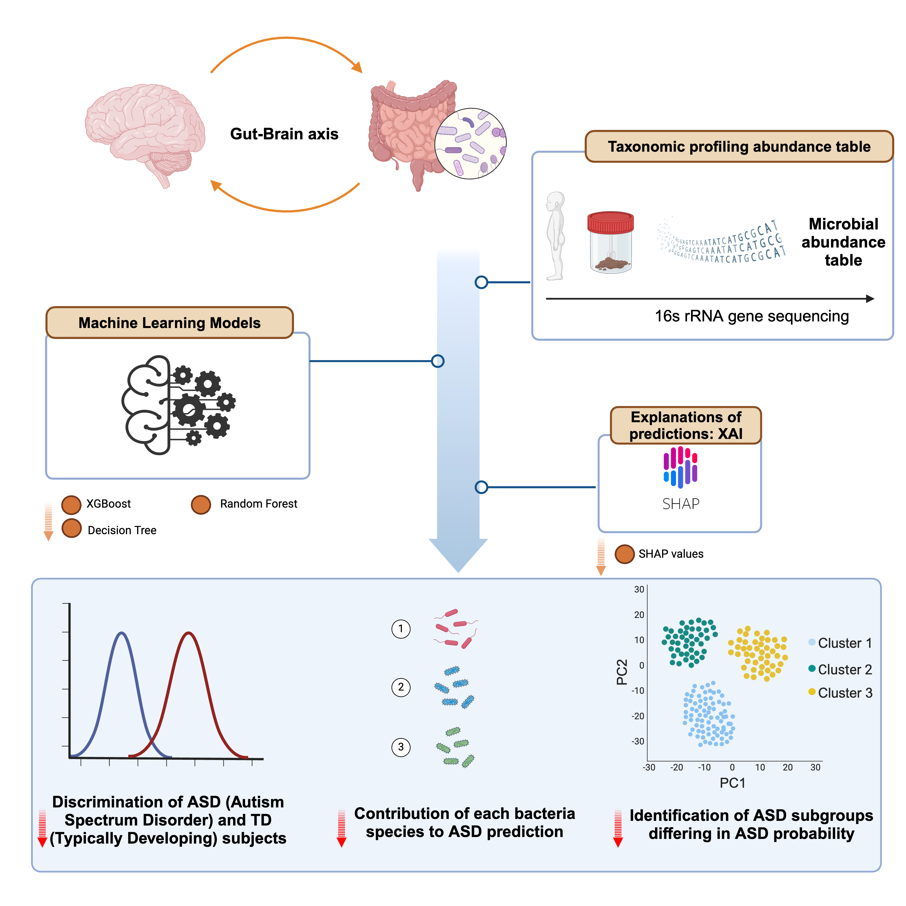
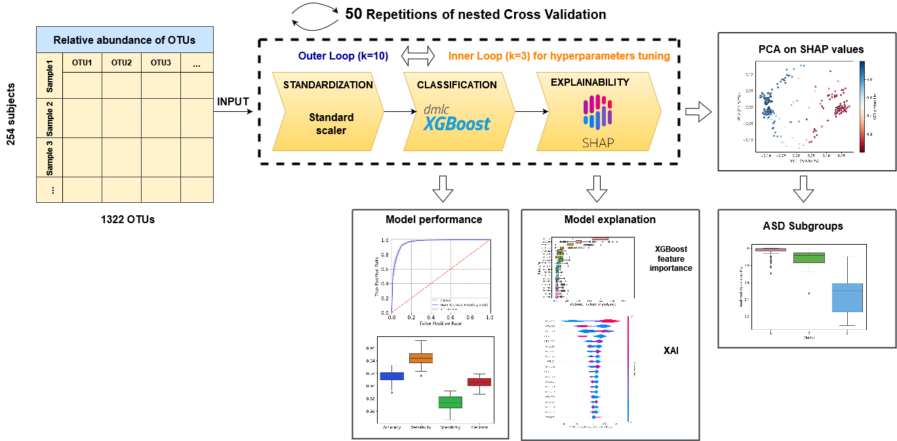

# Autism-gut-microbiome-XAI-analysis

Personalized identification of Autism-related bacteria in the gut microbiome using eXplainable Artificial Intelligence

# Paper
Personalized identification of Autism-related bacteria in the gut microbiome using eXplainable Artificial Intelligence

# Authors:
Pierfrancesco Novielli, Donato Romano, Michele Magarelli, Domenico Diacono, Alfonso Monaco, Nicola Amoroso, Mirco Vacca, Maria De Angelis, Roberto Bellotti, Sabina Tangaro

# Graphical abstract:

# Overview of the analysis:

# Software Requirements
The analysis has been tested on the following system:

Windows 11

The analysis was conducted in python.
Software versions used:

Python: 3.11.5

# Version Numbers for Python Packages in the Windows environment

* numpy version: 1.24.3
* pandas version: 1.5.3
* matplotlib version: 3.7.2
* shap version: 0.43.0
* sklearn version: 1.2.2
* xgboost version: xgboost 2.0.2
* seaborn version: 0.12.2
* scipy version: 1.10.1
* statannotations version: 0.2.3
